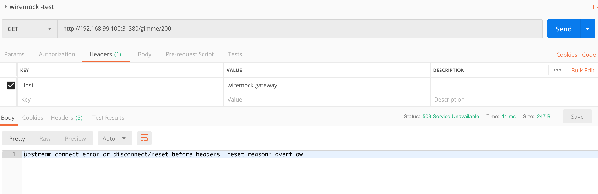

# istio-resiliency
## Testing resiliency strategies.

### Environment

Istio version: [1.3.0-rc1](https://github.com/istio/istio/releases/tag/1.3.0-rc.1)

Wiremock version: 2.24.1

Wiremock Dockerfile: [Dockerfile](wiremock/Dockerfile)

Environment setup guide: [minikube guide](https://github.com/stanislav-pimenov-epam/minikube-install-guide)

#### Deployment

 // **tbd** build and deploy wiremock instance

 // **tbd** scaling for circuit breaker tests

#### Istio configurations:
 - gateway //**tdb**
 - timeout 10s
 - retry 0

### Testing bulkhead on minikube

Given:
- Deployment with wiremock image

    1 wiremock pod with the following mapping inside:
```json
{
  "request": {
    "method": "GET",
    "urlPathPattern": "/gimme/200*"
  },
  "response": {
    "status": 200,
    "fixedDelayMilliseconds": 7000,
     "body": "{\"response\":\"200 after 7s\"}"
  }
}
```
- virtual service with timeout 10 sec and 0 retries.
```yaml
 http:
  - match:
    - uri:
        prefix: /gimme
    retries:
      attempts: 0
    route:
    - destination:
        host: wiremock.default.svc.cluster.local
        port:
          number: 8080
      weight: 100
    timeout: 10s
 ```
- destination rule without connection pool settings
- gatling performance test plan - 50rps during 2 minutes (enough to make all 200 wiremock threads busy) [WireMockThreadPoolTest.scala](gatling/WireMockThreadPoolTest.scala)


#### STEP 1

Execute gatling performance test plan without any connection pool settings


**Summary**: all wiremock threads were used. 93% request failed by timeout because wiremock application server was hanging


#### STEP 2

Add connection pool within destination rule to limit number of connection to wiremock by 190 ( just took a value less than 200  - which is the number of wiremock threads)
```yaml
 trafficPolicy:
    connectionPool:
      tcp:
        maxConnections: 190
      http:
        http1MaxPendingRequests: 1
        http2MaxRequests: 190
        maxRequestsPerConnection: 1
```


**Summary**: we got much more OK responses. Better response time

Wiremock threads grow from VisualVM shows that 190 threads were used


If wiremock call misses the thread pool we get fast response  (within 100 ms) with 503 error with **overflow** reason



#### STEP 3

Now lets add small buffer (10) for pending requests
```yaml
 trafficPolicy:
    connectionPool:
      tcp:
        maxConnections: 190
      http:
        http1MaxPendingRequests: 10
        http2MaxRequests: 190
        maxRequestsPerConnection: 1
```


Summary: we got more success calls, but because of buffer response time grew a little bit. That happened because now 10 requests are waiting for pool within that buffer

#### STEP 4

Rise maxRequestsPerConnection up to 100
```yaml
 trafficPolicy:
    connectionPool:
      tcp:
        maxConnections: 190
      http:
        http1MaxPendingRequests: 10
        http2MaxRequests: 190
        maxRequestsPerConnection: 100
```


#### Bulkhead Summary

Amount of errors become less and reached it's minimum. Response time didn't grow high. Wiremock server continume behave normally during the stress test and afterwards.
Since connection pool configuration is done against single pod it can help us to protect domain heads from "thread exhaustion" and hanging. Can be applied to SO, LP and other domain heads for further testing.

### Testing Circuit Breaker on minikube (istio 1.3-RC0)

Given:
- Deployment with wiremock image
- 2 wiremock pods with the following mappings inside
```json
{
  "request": {
    "method": "GET",
    "urlPathPattern": "/gimme/200*"
  },
  "response": {
    "status": 200,
    "fixedDelayMilliseconds": 30000,
    "body": "{\"response\":\"200 after 30s\"}"
   }
}
```
```json
{
  "request": {
    "method": "GET",
    "urlPathPattern": "/gimme/200*"
  },
  "response": {
    "status": 200,
    "body": "{\"response\":\"200\"}"
  }
}
```
- virtual service with timeout 10 sec and 0 retries.
```yaml
 http:
  - match:
    - uri:
        prefix: /gimme
    retries:
      attempts: 0
    route:
    - destination:
        host: wiremock.default.svc.cluster.local
        port:
          number: 8080
      weight: 100
    timeout: 10s
```
- destination rule without circuit breaker settings
- gatling performance test plan - 50rps during 2 minutes (enough to make all 200 wiremock threads busy) [WireMockThreadPoolTest.scala](gatling/WireMockThreadPoolTest.scala)


#### STEP 1 - no circuit breaker


**Summary**:
All request to pod nr1 produced timeout error because of big delay

#### STEP 2 - 1 pod ejection

Apply circuit breaker which eject pod for 30 sec
```yaml
 trafficPolicy:
    outlierDetection:
      baseEjectionTime: 30s
      consecutiveErrors: 10
      interval: 10s
      maxEjectionPercent: 100
      minHealthPercent: 0
```


**Summary**:
Amount of errors decreased down to 7%. We see that circuit breaker collect 10 consecutive errors and then open.

#### STEP 3 - 2 pods ejection

Apply 30 seconds delay for both wiremock pods. Repeat tests.


**Summary**:
Both pods were ejected. During ejection period gateway fell with fast 503 error saying "No healthy upstream"


#### Circuit Breaker summary

Circuit Breaker helps to avoid big amount of errors ejecting the pod, which produce a lot of errors or delays. At step 1 we got 50% of 504 errors because of timeouts to pod nr1. At step 2 pod nr1 was ejected by circuit breaker, traffic went to pod nr2 and amount of errors slightly decreased. At step 3 poth pods become slow, so both of them were ejected. During ejection period gateway responded with fast 503 error. For steps 2 and 3 we see that after 30 seconds circuit breaker was half open and traffic went to faulty pod, then circuit breaker opened again on bigger period
